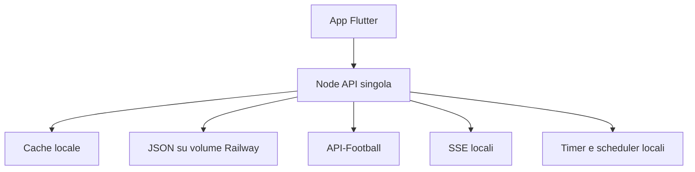
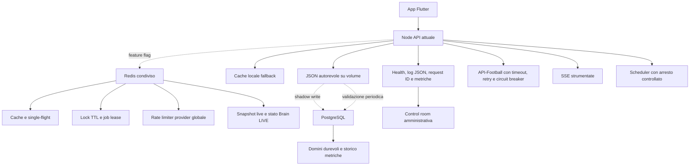

# BrainLive — report Fase 1

Data verifica: 8 settembre 2026. La Fase 1 è additiva: nessun endpoint pubblico o algoritmo LIVE, PREMATCH e LINEUP è stato riscritto. JSON e volume Railway restano la fonte autorevole.

## Architettura prima

## Architettura dopo la Fase 1

## File creati

- `src/featureFlags.ts`: configurazione prudente e disattivata per Redis/PostgreSQL.
- `src/redisInfrastructure.ts`: client condiviso, cache, JSON operativo, lock TTL, single-flight, lease e limiter globale.
- `src/postgresInfrastructure.ts`: pool, query strumentate, transazioni, migrazione opzionale e chiusura.
- `src/shadowStorage.ts`: shadow-write non bloccante, checksum e validazione periodica.
- `src/health.ts`: liveness, readiness e diagnostica.
- `src/lifecycle.ts`: SIGTERM/SIGINT, drain dei job, SSE e connessioni.
- `src/logger.ts`, `src/errorCenter.ts`, `src/telemetry.ts`: log JSON, request ID, error grouping e telemetria.
- `src/providerResilience.ts`: timeout, retry selettivo, backoff con jitter e circuit breaker.
- `src/adminInfrastructure.ts`, `src/metricsPersistence.ts`: snapshot leggero della control room e serie storiche.
- `src/firebaseAuth.ts`, `src/adminAudit.ts`: verifica Firebase opzionale, entitlement opzionale e audit admin.
- `src/engineTelemetry.ts`, `src/pushTelemetry.ts`, `src/lineupScheduler.ts`: metriche motori/notifiche e precompute LINEUP opzionale.
- `migrations/001_phase1_foundations.sql` e relativo `.down.sql`.
- `.env.example`, `docs/PHASE1_INFRASTRUCTURE.md`, `tests/infrastructure.test.ts`.

## File modificati

- Bootstrap/API: `src/index.ts`, `src/apiFootball.ts`, `src/providerRateLimiter.ts`.
- Runtime e shutdown: `src/poller.ts`, `src/brainLive.ts`, `src/brainPrematchV3.ts`, `src/stream.ts`.
- Cache e concorrenza: `src/cache.ts`, `src/inflight.ts`.
- Shadow state: `src/liveState.ts`, `src/brainLiveState.ts`, `src/prematchPublishedState.ts`, `src/prematchScanReport.ts`, `src/prematchTracker.ts`, `src/lineupPrediction.ts`.
- Sicurezza/metriche: `src/adminSessions.ts`, `src/push.ts`, `src/routes/brainLive.ts`, `src/routes/lineups.ts`.
- Dipendenze: `package.json`, `package-lock.json`.
- Flutter strettamente necessario alla control room: `lib/pages/admin_page.dart`, `lib/services/heartbeat_service.dart`.

## PostgreSQL

La migrazione reversibile prepara: utenti e Firebase UID, entitlement, preferiti, preferenze notifiche, fixture e metadati, pubblicazioni/versioni/scansioni/decisioni PREMATCH, performance/ROI, lineup previste e ufficiali, valutazioni, notification log e idempotency key, event outbox, audit admin, scheduler, metriche aggregate e documenti shadow. Sono presenti chiavi primarie, vincoli univoci, indici e timestamp UTC.

Le letture PostgreSQL restano disattivate. Lo shadow-write copre gli stati JSON importanti e non blocca mai il salvataggio legacy. La validazione rileva record mancanti, schema, checksum, timestamp ed errori di lettura/scrittura.

## Redis

Prefisso predefinito `brainlive:v1`:

- `cache:<chiave>`: cache condivisa fresh/stale.
- `live:snapshot`: snapshot live compatto.
- `brain-live:state`: stato operativo e cooldown Brain LIVE.
- `lock:singleflight:<chiave>`: richiesta condivisa tra istanze.
- `lock:job:<nome>`: lease scheduler.
- `provider:next-slot`: rate limiter globale API-Football.

Ogni lock ha TTL. Se Redis non risponde, cache locale, inflight locale e JSON continuano a funzionare. Il circuit breaker limita una possibile raffica verso il provider.

## Endpoint aggiunti

- `GET /health/live` pubblico e privo di segreti.
- `GET /health/ready` pubblico e privo di segreti.
- `GET /health/details` protetto e rate limited.
- `GET /api/admin/infrastructure` protetto.
- `GET /api/admin/infrastructure/history?range=5m|15m|1h|6h|24h|7d` protetto.
- `GET /api/admin/users` e `GET /api/admin/users/:id` protetti e limitati ai dati necessari.

Nessun contratto pubblico esistente è stato modificato.

## Metriche e dashboard

La control room include Overview, LIVE, Provider, API, SSE, Cache, Redis, Database, PREMATCH, LINEUP, Notifiche, Attività, Utenti, Sicurezza, Errori, Sistema e Costi. Lo snapshot server è memorizzato per 8 secondi e il client aggiorna ogni 10 secondi. Lo storico PostgreSQL è aggregato al minuto e mantenuto 30 giorni; il selettore mostra 5m, 15m, 1h, 6h, 24h e 7d.

Sono strumentati richieste/status/RPS/p50-p95-p99/payload/egress; CPU, memoria, heap, event loop, GC, uptime, handle e file descriptor quando disponibile; SSE; cache locale/Redis; pool/query/deadlock/storage PostgreSQL; quota e resilienza provider; notifiche; motori; shadow mismatch ed error center. Le stime di costo sono marcate come stime tecniche: nessun dato Railway Billing viene inventato.

Alert implementati: latenza API, error rate, event loop, memoria, Redis/PostgreSQL down, capacità e riconnessioni SSE, circuito/timeout/dato vecchio provider, poller/ingestion fermi, PREMATCH vecchio, code notifiche/provider, failure notifiche, deadlock e quota provider 80/95%.

## Sicurezza

Helmet, limite body, identificazione Express rimossa, CORS configurabile, confronto PIN timing-safe, sessioni admin hashate e con scadenza, rate limit admin/login, audit, redazione automatica dei segreti nei log e request ID. La verifica Firebase e l’enforcement premium sono predisposti ma restano disattivati fino a quando tutti i client invieranno stabilmente il token.

## Feature flag e rollback

Le flag sono documentate in `.env.example`. Redis, PostgreSQL, shadow-write, letture DB, enforcement premium e precompute LINEUP sono disattivati per impostazione iniziale. Il rollback consiste nel disattivare la singola flag; JSON e cache locale restano attivi. `POSTGRES_AUTO_MIGRATE` resta false: la migrazione produttiva deve essere esplicita.

Durante un deploy Railway la readiness diventa false, si fermano i timer, non partono nuovi job, si attende il lavoro attivo entro il timeout, si invia la chiusura SSE, si salvano le metriche e si chiudono Redis/PostgreSQL.

## Test e risultati

- Backend TypeScript: build riuscita.
- Backend: 63 test dopo l’ultimo incremento previsto; includono Redis on/off e single-flight, PostgreSQL on/off, shadow-write e mismatch, timeout/retry/circuit breaker, SSE shutdown, sessioni, Firebase, health/readiness, dashboard protetta, rate limit e SIGTERM con job attivo.
- Flutter mirato sui due file Fase 1: analisi statica senza problemi.
- Suite Flutter completa: eseguita; 70 test superati e 14 falliti in aree UI già modificate nel workspace (overflow PREMATCH, aspettative di vecchie schermate e timer del test smoke). Questi test non vanno nascosti: devono essere riallineati/corretti prima di una release mobile generale, anche se non indicano una regressione nei due file Fase 1.
- Audit dipendenze runtime: nessuna vulnerabilità alta o critica dopo l’aggiornamento Axios e le correzioni non breaking; restano avvisi moderati transitivi nella catena Firebase per cui npm propone solo un downgrade breaking, non applicato.

## Stato reale e limiti

Redis e PostgreSQL non sono stati provisionati né attivati in produzione in questo intervento. Di conseguenza lo shadow-write reale è **inattivo**, non esistono mismatch produttivi misurabili e non è possibile fornire un confronto affidabile di CPU/RAM prima/dopo. Il costo a riposo delle integrazioni disattivate è trascurabile, ma il dato va verificato su Railway dopo l’attivazione progressiva.

Non sono stati introdotti WebSocket, Kubernetes, NATS, Kafka/Redpanda o ClickHouse. Non sono stati rimossi JSON o volume Railway e non è iniziata la Fase 2.
